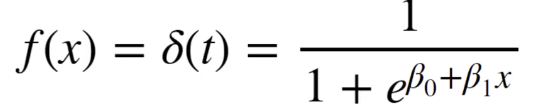

**1. What are the main assumptions of linear regression? What are the most common types of linear regression (most common estimation techniques)?**
* The two main assumptions: 1. The relationship between independent variable X and dependent variable Y should be linear. 2. The residual errors from the regression fit should be normally distributed. 
* The common types: 1. Ordinary Least Squares 2. Generalized Least Squares ([see OLS and GLS difference](https://www.quora.com/Regression-statistics-What-is-the-difference-between-Ordinary-least-square-and-generalized-least-squares)) 3.Penalized Least Squares (Lasso and Ridge)

**2. Describe the formula for logistic regression and how the algorithm is used for binary classification.**
*  We can use the result of f(x) as the probability of a data point being labeled as positive case. There is a cutoff value to choose to label the data points. For detailed mathematical derivation, please refer the [post](http://www.win-vector.com/blog/2011/09/the-simpler-derivation-of-logistic-regression/)

**3. How does a Decision Tree decide on its splits (what is the criteria for a split point)?**
* Find the feature that best splits the target class into the purest possible children nodes. There are splitting measures such as Information Gain, Gini Index, etc. 
* For details, please refer these links:https://github.com/YC-Coder-Chen/Tree-Math, https://medium.com/@rishabhjain_22692/decision-trees-it-begins-here-93ff54ef134, 
https://blog.quantinsti.com/gini-index/

**4. What advantages does a decision tree model have?**
* Very easy to interpret and understand
* Works on both continuous and categorical features
* No normalization or scaling necessary (not sensitive to outliers)
* Prediction algorithm runs very fast
* Helpful links: https://www.brighthubpm.com/project-planning/106000-advantages-of-decision-tree-analysis/, https://en.wikipedia.org/wiki/Decision_tree_learning

