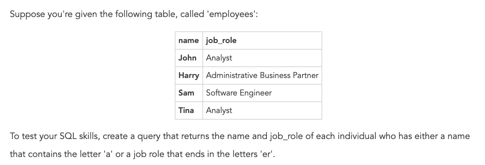
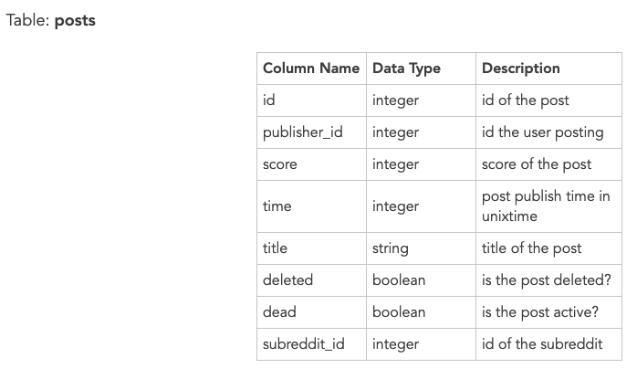
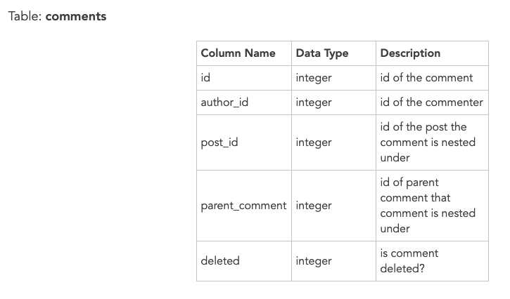

**1. Given the following datasets(shown as pictures below), can you write a SQL query that returns the top 3 performing ad groups each day?
Here we'll define performance as the ratio between revenue and spend (e.g. revenue / spend). In other words, the higher the ratio the better the peformance. There are multile ad groups in the datasets. The output of the query will be the date and an array of the ad groups.**
 

* First we need to merge the tables by date and ad groups. Next, we need to rank the the ads daily by the rev_spend_ratio. Finally, we need to limit the ads daily by the rank, where rank <= 3. Then, we need to aggregate the ad into array.


**2. What is wrong with this query?**
```
SELECT Id, YEAR(TrialDate) AS TrialYear 
FROM Payments
WHERE TrialYear <= 2015;
```
* TrialYear will be assigned at the end, so we cannot use the alias as the filter. Instead, we should use "WHERE YEAR(TrialDate) <= 2015"

**3. What is wrong with this query?**
```
SELECT Id, TrialDate 
FROM Payments
GROUP BY Id;
```
* There needs to be an aggregate function on TrialDate, otherwise we should include the TrialDate in the GROUP BY statement

**4. What is wrong with this query?**
```
SELECT UserId, AVG(Total) AS AvgOrderTotal
FROM Invoices
HAVING COUNT(OrderId) >= 1
```
* We use the AVG and Having functions, so we need to use a GROUP BY statement to accompany these statements

**5.**

* The query:
```
SELECT Employees.Name FROM Employees
JOIN Managers ON 
Employees.ManagedBy = Managers.Id
WHERE Managers.Name = “Sandy Kim”
```

**6.**

* The query:
```
SELECT Name FROM Employees
WHERE ManagedBy Is Null
```

**7.**

* The query:
```
SELECT
  name,
  job_role
FROM 
  employees
WHERE    
  #since a can be *anywhere* in the name, we % on either side
  #since we are looking for job roles that *end* in 'er', 
  #we put our % on the left-hand side
  (name LIKE %a% OR job_role LIKE %er')
;
```

**8. Suppose you're working for Reddit as an analyst. Reddit is trying to optimize its server allocation per subreddit, and you've been tasked with figuring out how much comment activity happens once a post is published.
Use your intuition to select a timeframe to query the data as well as how you would want to present this information to the partnering team. The solution will be a SQL query with assumptions that you would need to state if this was asked in an interview. You have the following tables:.**

 


* Since our goal is to optimize server allocation per subreddit, I'm going to sum comment activity per subreddit by date as the final table to present. Then we need to decide is what period we want to analyze. I'm going to say that a post needs to be active for at least 2 hours, and we're going to look at the last 30 days of posts. Next we need to join the posts table with the comments table. I only want comments made by the same day as the post as I aim to allocate the server resources to subreddits by daily level. (These all my assumptions, we can easily change the query if the stakeholders want different metrics )
```
SELECT
 #get the number of comments for each subreddit by day
 subreddit_id,
 date,
 SUM(num_comments_in_1_day) as num_comments_per_day
FROM(
 SELECT
     #group by subreddit, post_id, and day in the month
     subreddit_id,
     post_id,
     DATE_TRUNC(DATE(posts.time), day) as date,
     COUNT(distinct comments_id) as num_comments_in_1_day
 FROM(
     SELECT DISTINCT
         posts.subreddit_id,
         posts.id as post_id,
         posts.time,
         comments.id as comments_id
     FROM posts as posts
         # we're doing a left join so we don't exclude posts that don't have comments
         LEFT JOIN comments as comments
             # We only want the comments that made by the same day as the post
             ON posts.id = comments.post_id
             AND DATE_TRUNC(DATE(posts.time), day) = DATE_TRUNC(DATE(comments.time), day)
     # For the time period, we only want to analyze the past 30 days activity 
     WHERE posts.time <= TIME_NOW() - 60*60*2
         AND posts.time >= TIME_NOW() - 60*60*24*30
     )
 GROUP BY 1, 2, 3
 )
GROUP BY 1, 2
```
