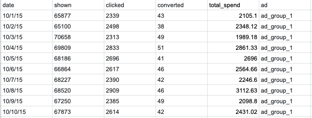
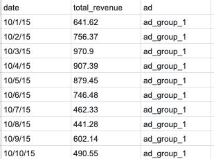
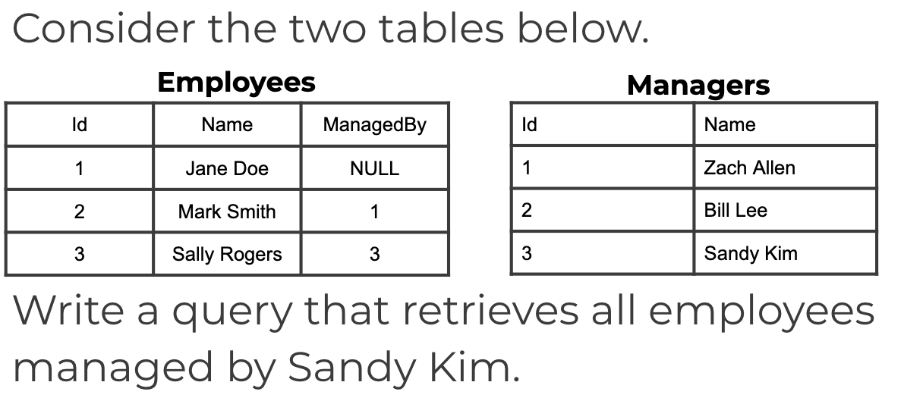
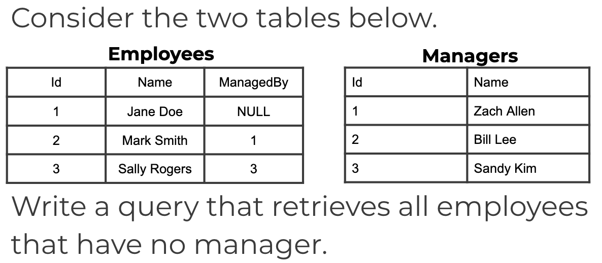

**1. Given the following datasets(shown as pictures below), can you write a SQL query that returns the top 3 performing ad groups each day?
Here we'll define performance as the ratio between revenue and spend (e.g. revenue / spend). In other words, the higher the ratio the better the peformance. There are multile ad groups in the datasets. The output of the query will be the date and an array of the ad groups.**
 

* First we need to merge the tables by date and ad groups. Next, we need to rank the the ads daily by the rev_spend_ratio. Finally, we need to limit the ads daily by the rank, where rank <= 3. Then, we need to aggregate the ad into array.


**2. What is wrong with this query?**
```
SELECT Id, YEAR(TrialDate) AS TrialYear 
FROM Payments
WHERE TrialYear <= 2015;
```
* TrialYear will be assigned at the end, so we cannot use the alias as the filter. Instead, we should use "WHERE YEAR(TrialDate) <= 2015"

**3. What is wrong with this query?**
```
SELECT Id, TrialDate 
FROM Payments
GROUP BY Id;
```
* There needs to be an aggregate function on TrialDate, otherwise we should include the TrialDate in the GROUP BY statement

**4. What is wrong with this query?**
```
SELECT UserId, AVG(Total) AS AvgOrderTotal
FROM Invoices
HAVING COUNT(OrderId) >= 1
```
* We use the AVG and Having functions, so we need to use a GROUP BY statement to accompany these statements

**5.**

* The query:
```
SELECT Employees.Name FROM Employees
JOIN Managers ON 
Employees.ManagedBy = Managers.Id
WHERE Managers.Name = “Sandy Kim”
```

**6.**

* The query:
```
SELECT Name FROM Employees
WHERE ManagedBy Is Null
```
