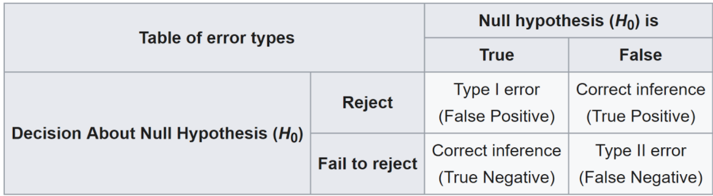

**1. You call 3 friends who live in Seattle and ask each of them independently whether Seattle is raining. Each of your friends has 2/3 chance telling you the truth while 1/3 chance mess with you by lying. You get 3 Yes from your friends. You also know that in any given day, there is 25% Seattle is raining. What is the probability that Seattle is actually raining?**
* Use Bayes' rule. P(rain | 3 Yes) = P(3 Yes| rain)* P(rain)/P(3 Yes) = P(3 Yes| rain)* P(rain) / (P(3 Yes| rain)* P(rain) + P(3 Yes| not rain)* P(not rain)) = (2/3)^3 * 1/4 / ((2/3)^3 * 1/4 + (1/3)^3 * 3/4)) = 8/11

**2. A new quantum message system has 0.8 probability of 0.8 of success in any attempt to send a message through. Calculate the of having 7 successes in 10 attempt?**
* Binomial distribution. 

**3. What is the difference between Type I vs Type II error?**
* A type I error occurs when the null hypothesis (H0) is true, but is rejected. It is asserting something that is absent, a false hit. 
A type I error may be likened to a so-called false positive (a result that indicates that a given condition is present when it actually is not present)
* A type II error occurs when the null hypothesis is false, but erroneously fails to be rejected. It is failing to assert what is present, a miss. 
A type II error may be compared with a so-called false negative (where an actual 'hit' was disregarded by the test and seen as a 'miss') in a test checking for a single condition with a definitive result of true or false.

**4. A new medical test for a virus has been created. 1% of the population has the virus. 99% of sick people with the virus test positive (indicating they have the virus). 99% of healthy individuals test negative for the virus. If a patient tested positive, what is the probability that they have the virus?**
* P(sick|positive) = P(positive|sick) * P(sick) / (P(positive|sick) * P(sick) + P(positive|healthy) * P(heathy)) = 0.99 * 0.01 / (0.99 * 0.01 + 0.01 * 0.99) = 0.5

